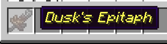
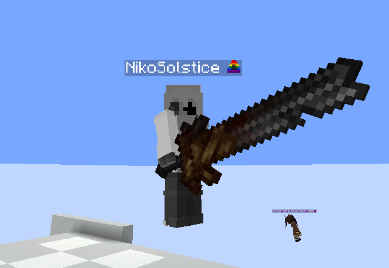
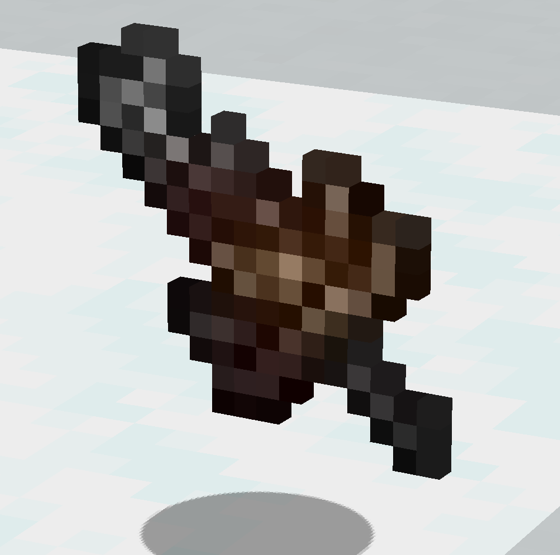

# CustomItemAPI
CIA, or CustomItemAPI, is an API that lets you register custom items in figura using renamed player heads, showing up properly both as a model AND in third person for others as well!

[Download](./CIA.lua)

## Example

(Note: the Dusk's Epitaph textures are not mine; they're Arathain's. i just don't have a better example yet)

Clone or download this repo into your avatar folder to try CIA out! The item the player head becomes depends on the name of the item!

